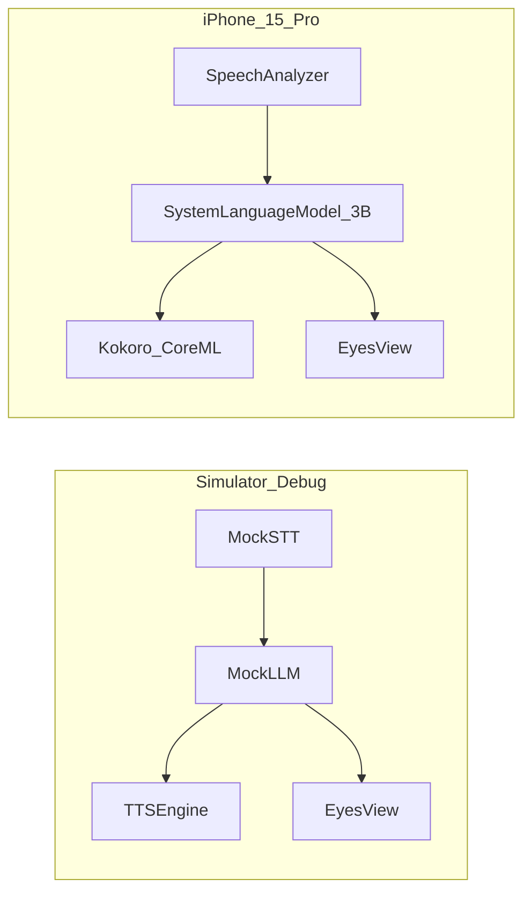

# iOS 로컬 디노 앱 (STT → 온디바이스 3B → TTS)

이 문서는 **2026-10-04 대화에서 확정한 계획**을 저장소에 다시 고정한다.  
지금 `ios/`에 커밋된 앱은 OpenAI Realtime 클라우드 경로이며, 이 문서의 로컬 앱과 **다른 제품**이다.

ESP32 펌웨어는 삭제하지 않는다. 다만 이 마일스톤의 개발 타깃은 **iPhone 15 Pro에서 음성이 기기 밖으로 나가지 않는 한 턴**이다.

## 한 줄

시뮬레이터 Debug로 눈 UI와 모의 루프를 먼저 돌리고, **15 Pro 실기**에서 SpeechAnalyzer · Apple 온디바이스 ~3B · Kokoro(없으면 AVSpeech)를 연결한다.

## 확정된 요청

- ESP32는 이 단계에서 접는다 (레포에서 지우지는 않음).
- 타깃: **iPhone 15 Pro**, 우선 **시뮬레이터 > Debug**.
- 구현: **STT → 로컬 3B LLM 다운로드 → TTS**.
- UI: 감정·대화 상태에 따른 **눈**만.

추가로 대화에서 고정한 것:

- 시뮬레이터는 Foundation Models / SpeechAnalyzer가 안 되거나 제한적인 경우가 많다 → **모의 STT/LLM으로 루프를 먼저 고정**.
- 온디바이스 3B는 15 Pro가 바닥. PCC(Private Cloud Compute) 서버 모델은 쓰지 않는다.
- 1차에 클라우드 LLM·ConvState 봉투 `{{a=…}}`·제어판/QR·App Store 제출은 하지 않는다.

## 왜 로컬인가

ESP32 + 클라우드 경로에서 본문 첫 소리까지 평균 약 4초, LLM TTFT가 병목이었다.  
15 Pro에서 STT/TTS/LLM을 같은 기기에 두면, 말 끝을 시스템이 확정한 뒤 첫 소리는 **대략 0.4–1.1초**를 노릴 수 있다.  
아이가 입 다문 뒤 1초는 침묵 대기 때문에 **매 턴 보장은 아니다**.

비행기 모드에서도 한 턴이 끝나야 “로컬”이다. 첫 설치 때 언어 팩·온디바이스 모델만 받는다.

## 최소 사양

| 항목 | 값 |
|------|-----|
| OS | **iOS 26** / iPadOS 26, Xcode 26, 호스트 macOS 26 계열 |
| 칩 | **A17 Pro 또는 M1 이상**, RAM 8GB급 |
| 1차 실기기 | **iPhone 15 Pro** |
| LLM | Apple Intelligence **온디바이스** (시스템 ~3B). PCC 끔 |
| 시뮬레이터 | `iPhone 15 Pro`. 없으면 같은 SDK의 16/17 Pro |

그 아래(A16 일반 15 등)는 STT·TTS만 로컬이고, 같은 품질의 로컬 3B + 1초 근처 턴은 스펙으로 걸지 않는다.

## 파이프라인

```
LISTEN → PROCESS → SPEAK   (반이중)
마이크  →  STT  →  LLM(~3B)  →  TTS  →  스피커
```

PROCESS 중 마이크 끔. 재생 후 300–500ms STT 무시.  
프롬프트는 매 턴 `TurnRouter`가 고른 짧은 카드(방·박·주제)다. 히스토리 약 20턴.  
ConvState 봉투 `{{a=…}}` 는 쓰지 않는다. 설계: [llm-preprocess.md](./llm-preprocess.md).

엔진은 프로토콜로 나눈다. 런타임 availability로 구현체를 고른다.

```
STTEngine / LLMEngine / TTSEngine
```

| 구성 | 시뮬레이터 Debug | iPhone 15 Pro |
|------|------------------|---------------|
| 눈 UI, 상태 머신, 보이스 피커 | 동작 | 동작 |
| STT | Mock (탭·텍스트 주입) | `SpeechAnalyzer` / `SpeechTranscriber` `en_US` |
| LLM | Mock (맥에 Apple Intelligence 있으면 Foundation Models 옵션) | `SystemLanguageModel` ~3B, 스트림 |
| TTS | AVSpeech. Kokoro mlpackage가 있으면 시도 | Kokoro Core ML, 실패 시 AVSpeech |



눈 상태: `idle`, `listen`, `think`, `speak`, `clarify`, `happy`.  
Debug 오버레이: 자막, `stt_ms` / `ttft_ms` / `tts_first_ms`, 엔진 종류.

## 가중치

대용량 `.mlpackage` / onnx는 git에 넣지 않는다. `ios/Models/`는 로컬 캐시.

| 엔진 | 출처 | 앱이 하는 일 |
|------|------|----------------|
| STT | iOS SpeechAnalyzer / SpeechTranscriber `en_US` | 시스템 언어 팩. HF 변환 없음 |
| LLM ~3B (시스템) | Apple `SystemLanguageModel` | 온디바이스 ~3B. PCC 금지. 별도 weight 파일 없음 |
| LLM ~3B (다운로드) | `Qwen2.5-3B-Instruct` Q4_K_M GGUF (~2GB) | `scripts/ios_models/fetch_llm.sh` → `ios/Models/LLM`. llama.cpp Metal, ctx ~2k |
| TTS | sherpa-onnx + Supertonic-3 한국어 int8 CPU, 실패 시 AVSpeech | `scripts/ios_models/fetch_tts.sh` → `ios/Models/TTS`. 기기 Documents로 복사 |

다운로드 LLM:

```bash
./scripts/ios_models/fetch_llm.sh
```

TTS (15 Pro):

```bash
./scripts/ios_models/fetch_sherpa_xcframework.sh
./scripts/ios_models/fetch_tts.sh
```

가중치는 git에 넣지 않는다. 앱 Documents에 복사한다. Kokoro는 영어·중국어 중심이라 한국어 아이 말투에 쓰지 않는다.

## TTS 보이스

시스템 한 목소리에 고정하지 않는다. `VoiceProfile` + `VoiceCatalog.json`.

- 백엔드: `avSpeech` | `kokoro`
- 프리셋 5–10개, 영어 친근 보이스만 1차 노출
- 슬라이더: rate / pitch / energy
- 미리듣기: `Hi, I'm Dino!`
- Kokoro 로드 실패 → 같은 프로필의 AVSpeech
- 화자 클로닝(`adoptReferenceAudio`)은 프로토콜만 예약

LLM 첫 문장 종결에서 `speak` 시작.

## 레포 레이아웃 (로컬 앱)

구현 시 되살릴 경로. 2026-10-05 머지에서 원격 Realtime 앱을 우선하면서 **이 트리의 워킹 카피는 제거됐다.**

```
ios/README.md                 # 로컬 앱 빌드·에셋·라이선스 (Realtime README와 분리할 것)
ios/project.yml               # XcodeGen. IPHONEOS_DEPLOYMENT_TARGET = 26.0
ios/Talkbot/                  # SwiftUI
ios/Talkbot/Engines/          # 프로토콜 + Mock / SpeechAnalyzer / Foundation / Kokoro / AVSpeech
ios/Talkbot/Conversation/     # ConversationController
ios/Talkbot/UI/EyesView.swift
ios/Talkbot/Voice/            # VoiceProfile, VoiceCatalog.json
ios/Models/                   # gitignore, .gitkeep만
scripts/ios_models/           # fetch / convert / smoke
```

번들 id 초안: `com.talkbot.dino`. Swift 6, Debug `-Onone`.  
Privacy: `NSMicrophoneUsageDescription`, `NSSpeechRecognitionUsageDescription`.

## 구동

필요: macOS 26, Xcode 26, [XcodeGen](https://github.com/yonaskolb/XcodeGen) (`brew install xcodegen`).  
가중치 스크립트: `pip install huggingface_hub kokoro soundfile` (변환 시).

### 시뮬레이터 Debug

```bash
cd ios
xcodegen generate
xed Talkbot.xcodeproj
```

Scheme **Talkbot**, configuration **Debug**, destination **iPhone 15 Pro**.

```bash
xcodebuild -project ios/Talkbot.xcodeproj -scheme Talkbot \
  -destination 'platform=iOS Simulator,name=iPhone 15 Pro' \
  -configuration Debug build
```

탭으로 한 줄 입력 → Say. 기어: 보이스 프리셋, rate / pitch / energy.  
시뮬레이터는 mock STT/LLM + AVSpeech. 맥에 Apple Intelligence가 있으면 LLM만 실경로 옵션.

### 15 Pro 실기

1. 설정에서 Apple Intelligence 온디바이스, Speech `en_US` 다운로드.
2. 마이크·음성 인식 권한.
3. Debug로 설치. `ENABLE_DEBUG_DYLIB=NO` 이거나 디버거를 붙이지 않을 때는 Debug dylib 스텁이 바로 종료되지 않게 한다.
4. 로그: 말 끝(EOU) → STT → TTFT → TTS 첫 소리.

## 마일스톤

1. 시뮬레이터 Debug: 눈 + 탭 턴 + AVSpeech 보이스 선택.
2. Kokoro 다운로드·Core ML 변환 재현, 프리셋 전환.
3. SpeechAnalyzer + 애플 3B 다운로드 UI + 로컬 턴.
4. 15 Pro 타이밍 로그.
5. 백로그: ConvState, WhisperKit, 자체 LLM 변환, 레퍼런스 오디오 클로닝.

## 지금 저장소와의 관계

| | 이 문서 (로컬 앱) | 현재 `ios/` (커밋됨) |
|--|-------------------|----------------------|
| 음성 | STT → LLM → TTS, 기기 안 | OpenAI Realtime WebSocket |
| 키 | 없음 (시스템 팩 + Kokoro) | OpenAI API / 토큰 서버 |
| UI | 눈, Debug 시트 | 세로 파지 디노 인형 스프라이트, 보호자 설정 |
| OS 바닥 | iOS 26 | iOS 16+ |

로컬 앱을 다시 올릴 때는 Realtime 트리와 디렉터리를 섞지 않는다 (`ios/Local/` 또는 브랜치 분리).
